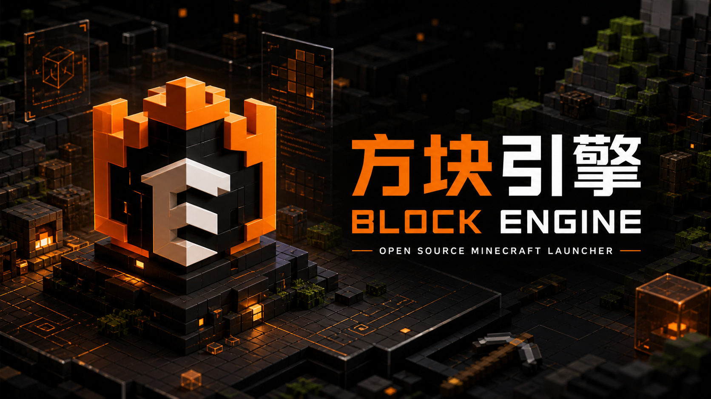

<div align="center">
  

  # 方块引擎 · Block Engine

  **面向 Minecraft Java 版的开源桌面启动器与游戏工作台**

  `Windows` · `Tauri` · `Vue` · `Rust` · `GPL-3.0-only`
</div>

## 项目简介

方块引擎将游戏环境、账户、Java、模组与资源、世界和下载任务集中到同一个桌面客户端中。项目基于 [Axolotl Launcher](https://github.com/Mystic-Stars/Axolotl) 继续开发，而 Axolotl Launcher 基于 [Modrinth App](https://github.com/modrinth/code)。本仓库保留上游版权、许可证与修改说明。

## 主要能力

- Minecraft Java 版游戏环境创建、导入、管理与启动
- Microsoft 正版账户、离线账户及第三方账户管理
- 自动查找和管理本机 Java 运行环境
- 浏览、安装和更新模组、整合包、资源包、数据包与光影
- Modrinth 与 CurseForge 内容支持
- 下载任务、日志、世界与服务器管理
- 主题、色彩、布局、小组件和启动参数设置
- Windows 自定义安装器与中文路径支持

## 下载与交流

当前自动更新服务暂停，新版本通过官方群发布。

- 官方 QQ 群：`144788610`
- 爱发电：https://afdian.com/p/9e1d939094b611f1b1c75254001e7c00

## 本地开发

基础环境：Node.js 24+、pnpm 10、Rust 1.90、Java 与 Windows Build Tools。

```bash
pnpm install
pnpm --filter @modrinth/app-frontend build
cargo test --workspace
```

Windows 完整打包：

```bat
apps\app\build-windows.cmd
```

更完整的环境与打包说明见 [BLOCK_ENGINE_DEVELOPMENT_ZH-CN.md](./BLOCK_ENGINE_DEVELOPMENT_ZH-CN.md)。

## 许可证与上游署名

方块引擎桌面程序及本项目自行编写、修改的 GPL 兼容代码使用 **GNU General Public License v3.0 only**（`GPL-3.0-only`）。完整正文见 [LICENSE](./LICENSE)，复制与第三方许可说明见 [COPYING.md](./COPYING.md) 和各子包的许可证文件。

> 第三方素材、数据和依赖仍适用其各自许可证，不能统一改写为 GPL。分发二进制版本时必须按 GPLv3 提供对应源代码或有效源码获取方式，并保留上游署名与修改说明。

本项目与 Mojang Studios、Microsoft、Modrinth/Rinth, Inc. 无隶属或背书关系。Minecraft 是 Mojang Studios / Microsoft 的商标。